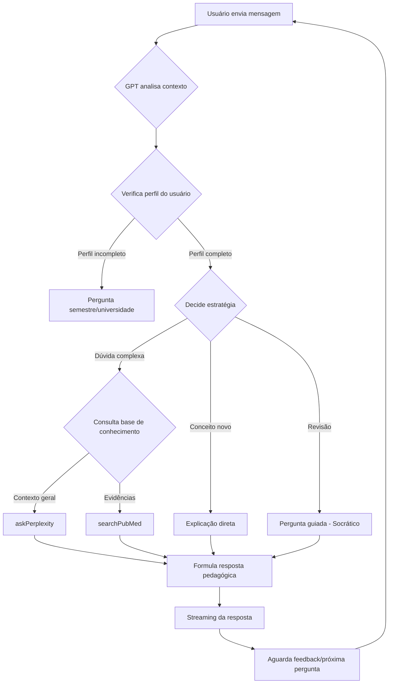

# 🦷 Plano Odonto GPT - Chat de Ensino Conversacional

> **Objetivo**: Transformar o Odonto GPT em um tutor conversacional focado em ensino de odontologia através de conversas fluidas, sem especialistas ou artefatos.

---

## 📋 Resumo Executivo

### O Que Muda

| Antes | Depois |
|-------|--------|
| 5 agentes especializados | 1 agente único (Odonto GPT) |
| Geração de artefatos (resumos, flashcards, etc.) | Apenas conversação pedagógica |
| Múltiplas ferramentas de salvamento | Apenas consulta a bases de conhecimento |
| Interface com seletor de agentes | Interface limpa e conversacional |
| Foco em produção de conteúdo | Foco em ensino através de diálogo |

### O Que Permanece

✅ **Consulta a bases de conhecimento** (Perplexity, PubMed)  
✅ **Perfil do usuário** (semestre, universidade, especialidade)  
✅ **Histórico de conversas**  
✅ **Vercel AI SDK** e **OpenRouter**  
✅ **Interface moderna e responsiva**

---

## 🎯 Visão Geral

### Conceito Central

O **Odonto GPT** será um **professor virtual experiente** que ensina odontologia através de:

1. **Perguntas Guiadas** (Método Socrático) - não dar respostas prontas
2. **Scaffolding Progressivo** - começar do básico e aumentar complexidade
3. **Adaptação ao Nível** (ZPD) - calibrar explicações ao estudante
4. **Feedback Imediato** - validar e corrigir com gentileza
5. **Bases de Conhecimento** - fundamentar respostas em evidências

### Exemplo de Interação

**❌ Antes (Resposta Direta):**
```
Aluno: Como fazer uma restauração classe II?
GPT: Uma restauração classe II envolve os seguintes passos:
     1. Anestesia...
     2. Isolamento...
     [resposta completa pronta]
```

**✅ Depois (Método Socrático):**
```
Aluno: Como fazer uma restauração classe II?
GPT: Ótima pergunta! Antes de explicarmos o passo a passo, 
     você consegue me dizer qual é a principal característica 
     de uma cavidade classe II?

Aluno: Envolve superfícies proximais?
GPT: Exatamente! 🎯 E por que isso é importante para o preparo 
     cavitário? Pense na anatomia do dente...
```

---

## 🗺️ Roadmap de Implementação

### Fase 1: Planejamento (2-3 dias)
- ✅ Análise da arquitetura atual
- ✅ Design da nova arquitetura
- ✅ Definição de técnicas pedagógicas
- ✅ Plano de integração com bases de conhecimento

### Fase 2: Backend (3-4 dias)
- 🔄 Remover agentes desnecessários
- 🔄 Simplificar ferramentas (tools)
- 🔄 Reescrever system prompt pedagógico
- 🔄 Otimizar API de chat

### Fase 3: Frontend (2-3 dias)
- 🔄 Remover seletor de agentes
- 🔄 Otimizar interface conversacional
- 🔄 Adicionar indicadores de consulta a bases
- 🔄 Remover UI de artefatos

### Fase 4: Pedagógico (3-4 dias)
- 🔄 Implementar Método Socrático
- 🔄 Implementar Scaffolding
- 🔄 Implementar ZPD
- 🔄 Implementar consulta proativa a bases

### Fase 5: Testes (2-3 dias)
- 🔄 Testes de conversação
- 🔄 Validação pedagógica
- 🔄 Testes de integração
- 🔄 Refinamento final

**Total: 12-17 dias**

---

## 🏗️ Arquitetura Técnica

### Componentes Principais

```
┌─────────────────────────────────────────┐
│  Frontend (Next.js + React)             │
│  ┌───────────────────────────────────┐  │
│  │ OdontoAIChat Component            │  │
│  │ - Interface conversacional        │  │
│  │ - Indicadores de fonte            │  │
│  │ - Typing indicators               │  │
│  └───────────────────────────────────┘  │
└─────────────────────────────────────────┘
                    ↓
┌─────────────────────────────────────────┐
│  API Layer (Edge Runtime)               │
│  ┌───────────────────────────────────┐  │
│  │ /api/newchat                      │  │
│  │ - Roteamento simplificado         │  │
│  │ - Streaming de respostas          │  │
│  └───────────────────────────────────┘  │
└─────────────────────────────────────────┘
                    ↓
┌─────────────────────────────────────────┐
│  AI Layer (Vercel AI SDK)               │
│  ┌───────────────────────────────────┐  │
│  │ Odonto GPT (Agente Único)         │  │
│  │ - System prompt pedagógico        │  │
│  │ - 3 ferramentas ativas            │  │
│  └───────────────────────────────────┘  │
└─────────────────────────────────────────┘
                    ↓
┌─────────────────────────────────────────┐
│  Tools (Ferramentas)                    │
│  ┌─────────────┬─────────────┬────────┐ │
│  │askPerplexity│searchPubMed │updateU │ │
│  │             │             │Profile │ │
│  └─────────────┴─────────────┴────────┘ │
└─────────────────────────────────────────┘
                    ↓
┌─────────────────────────────────────────┐
│  External Services                      │
│  ┌──────────────┬──────────────────────┐│
│  │ Perplexity   │ PubMed               ││
│  │ (Contexto)   │ (Evidências)         ││
│  └──────────────┴──────────────────────┘│
└─────────────────────────────────────────┘
```

### Ferramentas Mantidas

| Ferramenta | Uso | Quando Usar |
|------------|-----|-------------|
| **askPerplexity** | Pesquisas gerais, contexto atualizado | Protocolos, técnicas, atualizações |
| **searchPubMed** | Artigos científicos, evidências | Questões clínicas, pesquisa |
| **updateUserProfile** | Salvar perfil do estudante | Semestre, universidade, especialidade |

### Ferramentas Removidas

❌ `saveSummary`  
❌ `saveFlashcards`  
❌ `saveMindMap`  
❌ `savePracticeExam`  
❌ `saveResearch`  
❌ `saveImageAnalysis`

---

## 🎓 Técnicas Pedagógicas

### 1. Método Socrático
**Objetivo**: Estimular raciocínio crítico através de perguntas guiadas

**Como Implementar**:
- Fazer perguntas antes de dar respostas
- Validar compreensão progressivamente
- Guiar o aluno à resposta correta

**Exemplo**:
```
❌ "A anestesia local funciona bloqueando canais de sódio..."
✅ "Você sabe por que a anestesia impede a transmissão nervosa?"
```

### 2. Scaffolding Progressivo
**Objetivo**: Construir conhecimento gradualmente

**Como Implementar**:
- Começar com fundamentos
- Aumentar complexidade aos poucos
- Retornar a conceitos básicos se necessário

**Exemplo**:
```
1º: "Vamos começar pela anatomia básica do dente..."
2º: "Agora que você entende a estrutura, vamos falar de preparo..."
3º: "Com essa base, podemos discutir técnicas avançadas..."
```

### 3. Zona de Desenvolvimento Proximal (ZPD)
**Objetivo**: Adaptar ao nível do estudante

**Como Implementar**:
- Usar perfil do usuário (semestre, especialidade)
- Calibrar linguagem e profundidade
- Desafiar sem frustrar

**Exemplo**:
```
1º semestre: "Vamos revisar a anatomia dental básica..."
Residente: "Considerando a literatura recente sobre biomateriais..."
```

### 4. Feedback Imediato
**Objetivo**: Validar e corrigir em tempo real

**Como Implementar**:
- Validar respostas do aluno
- Corrigir com gentileza
- Explicar o "porquê" dos erros
- Reforçar acertos

**Exemplo**:
```
Aluno: "A classe II envolve superfícies oclusais?"
GPT: "Quase! 🙂 A classe II envolve superfícies PROXIMAIS 
      (mesial/distal). Você pode estar confundindo com a 
      classe I, que é oclusal. Vamos revisar a classificação?"
```

---

## 🔄 Fluxo de Conversação



---

## 📊 Critérios de Sucesso

### Métricas Técnicas
- ✅ Apenas 1 agente ativo
- ✅ Apenas 3 ferramentas ativas
- ✅ 0 funcionalidades de artefatos
- ✅ Tempo de resposta < 3s (sem consultas)
- ✅ Tempo de resposta < 10s (com consultas)

### Métricas Pedagógicas
- ✅ 80%+ das respostas usam perguntas guiadas
- ✅ Adaptação clara ao nível do estudante
- ✅ Feedback imediato em 100% das interações
- ✅ Consulta a bases quando apropriado

### Métricas de Experiência
- ✅ Interface limpa e focada
- ✅ Indicadores claros de consulta
- ✅ Fluxo conversacional fluido
- ✅ Tom encorajador e empático

---

## ⚠️ Riscos e Mitigações

| Risco | Impacto | Mitigação |
|-------|---------|-----------|
| Usuários sentem falta de artefatos | Médio | Comunicar nova proposta de valor, focar em qualidade conversacional |
| Qualidade das consultas externas | Alto | Treinar GPT para queries precisas, validar relevância |
| Adaptação ao nível do estudante | Alto | Sistema robusto de perfil, exemplos claros no prompt |
| Performance de consultas | Médio | Otimizar timing, cache, indicadores de progresso |

---

## 🚀 Próximos Passos

### Imediatos (Hoje)
1. ✅ Revisar e aprovar este plano
2. 🔄 Criar branch `feature/conversational-teaching`
3. 🔄 Iniciar Fase 1: Análise detalhada

### Curto Prazo (Esta Semana)
4. 🔄 Refatorar `config.ts` (remover agentes)
5. 🔄 Refatorar `definitions.ts` (remover tools)
6. 🔄 Reescrever system prompt

### Médio Prazo (Próximas 2 Semanas)
7. 🔄 Atualizar frontend
8. 🔄 Implementar técnicas pedagógicas
9. 🔄 Testes e refinamento

---

## 📚 Recursos e Referências

### Documentação Completa
- **Plano Detalhado**: `.context/plans/odonto-gpt-conversational-teaching.md`
- **Arquitetura Atual**: `lib/ai/agents/config.ts`
- **API de Chat**: `app/api/newchat/route.ts`

### Bases de Conhecimento
- **PubMed**: https://pubmed.ncbi.nlm.nih.gov/
- **Perplexity AI**: https://www.perplexity.ai/

### Técnicas Pedagógicas
- Zona de Desenvolvimento Proximal (Vygotsky)
- Método Socrático
- Scaffolding (Wood, Bruner, Ross)

---

## 💡 Conclusão

Este plano transforma o Odonto GPT de um **sistema multi-agente com geração de artefatos** em um **tutor conversacional focado em ensino pedagógico**.

### Filosofia Central

> "Não dê o peixe, ensine a pescar."

O Odonto GPT não vai mais **gerar conteúdo** para o aluno.  
Ele vai **ensinar através de conversas**, usando perguntas guiadas, adaptação ao nível do estudante, e consulta a bases de conhecimento para fundamentar o aprendizado.

### Diferencial

- **Conversação fluida** > Geração de conteúdo
- **Perguntas guiadas** > Respostas prontas
- **Adaptação ao estudante** > Abordagem única
- **Bases de conhecimento** > Conhecimento estático

---

**Status**: ✅ Planejamento Completo  
**Próximo**: 🔄 Iniciar Implementação  
**Prazo**: 12-17 dias  
**Prioridade**: Alta
