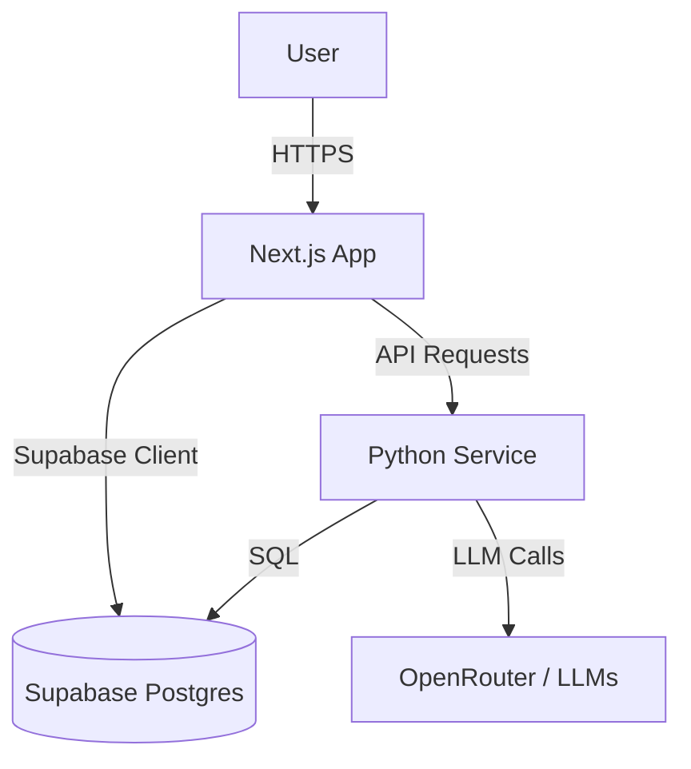

# Architecture

## High-Level Overview
The system uses a **Hybrid Architecture** combining a Next.js frontend for UI/UX and a Python service for AI agent orchestration, unified by Supabase for data persistence and authentication.

## Frontend Layer (Next.js)
- **Framework**: Next.js 14+ (App Router).
- **Language**: TypeScript.
- **Styling**: Tailwind CSS.
- **Key Directories**:
  - `app/`: Routes and Pages (Server & Client Components).
  - `components/`: UI Library and specialized visualization components.
  - `lib/`: Business logic, hooks (e.g., `useAgnoChat`), and helpers.

## Backend Layer (Python Service)
- **Path**: `odonto-gpt-agno-service/`
- **Role**: AI Agent Orchestration.
- **Framework**: Agno (Agentic Framework).
- **Responsibilities**:
  - Processing dental queries.
  - RAG (Retrieval Augmented Generation).
  - Generating artifacts (briefs, summaries, images).

## Data Layer (Supabase)
- **PostgreSQL**: Primary data store.
- **Authentication**: Handles user sessions and Row Level Security (RLS).
- **Storage**: Used for images and generated documents.
- **Vector Store**: `pgvector` for semantic search and RAG.

## Integration Patterns
- **Frontend-Backend**: HTTP/API calls.
- **Frontend-DB**: Supabase JS Client for direct secure access.
