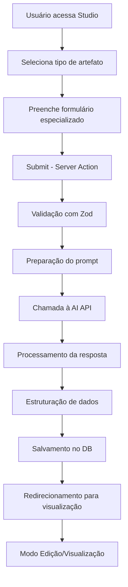

# Arquitetura do Sistema Odonto GPT - Artefatos

## Visão Geral do Sistema

O Odonto GPT é uma plataforma de IA especializada em odontologia que gera **artefatos** - objetos de conhecimento estruturados, persistentes e interativos. Diferente de conversas de chat efêmeras, artefatos são documentos que o usuário possui, edita e estuda.

## Princípios Arquiteturais

### 1. Separação Chat vs Studio
- **Chat**: Conversação exploratória e consultas rápidas
- **Studio**: Geração deliberada de artefatos através de formulários estruturados
- **Biblioteca**: Gerenciamento e acesso aos artefatos criados

### 2. Artefatos como First-Class Citizens
```typescript
interface Artifact {
  id: string;
  type: ArtifactType;
  title: string;
  content: JSONB; // Estrutura flexível por tipo
  metadata: ArtifactMetadata;
  createdAt: Date;
  updatedAt: Date;
  userId: string;
}

type ArtifactType = 
  | 'research'
  | 'flashcard'
  | 'report'
  | 'summary'
  | 'mindmap'
  | 'quiz';
```

## Stack Tecnológico

### Frontend
- **Framework**: Next.js 14+ (App Router)
- **UI**: React 18+ com TypeScript
- **Styling**: Tailwind CSS
- **State**: Zustand ou Jotai (estado local), React Query (server state)
- **Forms**: React Hook Form + Zod

### Backend
- **Runtime**: Next.js Server Actions + API Routes
- **Database**: PostgreSQL (Supabase ou Neon)
- **ORM**: Prisma
- **Storage**: S3-compatible (para PDFs, imagens)

### AI/ML
- **Orquestração**: Vercel AI SDK
- **Modelos**:
  - GPT-4o (OpenAI) - Geração de conteúdo estruturado
  - Claude 3.5 Sonnet (Anthropic) - Raciocínio complexo
  - Gemini 1.5 Pro (Google) - Contextos longos
  - Perplexity Sonar - Pesquisas com citações

### Bibliotecas Especializadas
- **PDF**: react-pdf, jspdf
- **Editor Rico**: Tiptap ou Plate
- **Mapas Mentais**: React Flow (recomendado) ou Mermaid.js
- **Markdown**: remark, rehype
- **Diagramas**: Mermaid.js

## Arquitetura de Dados

### Schema Principal (Prisma)
```prisma
model Artifact {
  id          String   @id @default(cuid())
  type        String   // enum: research, flashcard, etc
  title       String
  content     Json     // JSONB - estrutura específica por tipo
  metadata    Json     // metadados flexíveis
  userId      String
  projectId   String?  // opcional, para organização
  
  createdAt   DateTime @default(now())
  updatedAt   DateTime @updatedAt
  
  user        User     @relation(fields: [userId], references: [id])
  project     Project? @relation(fields: [projectId], references: [id])
  tags        Tag[]    @relation("ArtifactTags")
  
  @@index([userId, type])
  @@index([createdAt])
}

model User {
  id        String     @id @default(cuid())
  email     String     @unique
  name      String?
  artifacts Artifact[]
  projects  Project[]
}

model Project {
  id          String     @id @default(cuid())
  name        String
  description String?
  userId      String
  artifacts   Artifact[]
  user        User       @relation(fields: [userId], references: [id])
}

model Tag {
  id        String     @id @default(cuid())
  name      String     @unique
  artifacts Artifact[] @relation("ArtifactTags")
}
```

## Fluxo de Geração de Artefatos



## Padrão de Componentes

### Estrutura de Diretórios
```
src/
├── app/
│   ├── (auth)/
│   ├── dashboard/
│   │   ├── biblioteca/
│   │   │   ├── [type]/
│   │   │   │   └── [id]/
│   │   ├── studio/
│   │   │   └── new/
│   │   └── chat/
├── components/
│   ├── artifacts/
│   │   ├── ArtifactRenderer.tsx
│   │   ├── types/
│   │   │   ├── ResearchViewer.tsx
│   │   │   ├── FlashcardDeck.tsx
│   │   │   ├── ReportViewer.tsx
│   │   │   ├── SummaryViewer.tsx
│   │   │   ├── MindMapViewer.tsx
│   │   │   └── QuizViewer.tsx
│   │   └── forms/
│   │       ├── CreateResearchForm.tsx
│   │       ├── CreateFlashcardForm.tsx
│   │       └── ...
│   ├── ui/ (shadcn/ui)
│   └── shared/
├── lib/
│   ├── ai/
│   │   ├── providers/
│   │   │   ├── openai.ts
│   │   │   ├── anthropic.ts
│   │   │   ├── perplexity.ts
│   │   │   └── gemini.ts
│   │   ├── prompts/
│   │   │   └── artifact-templates.ts
│   │   └── generators/
│   │       ├── research.ts
│   │       ├── flashcard.ts
│   │       └── ...
│   ├── db/
│   │   └── prisma.ts
│   └── utils/
└── types/
    └── artifacts.ts
```

## Segurança e Validação

### 1. Validação de Entrada
```typescript
// Exemplo: Schema Zod para Flashcards
const createFlashcardSchema = z.object({
  topic: z.string().min(3).max(200),
  numberOfCards: z.number().min(5).max(100),
  difficulty: z.enum(['beginner', 'intermediate', 'advanced']),
  sourceFile: z.instanceof(File).optional(),
});
```

### 2. Rate Limiting
- Limite de gerações por usuário/dia
- Throttling de requests à AI
- Queue system para processos longos

### 3. Sanitização de Conteúdo
- DOMPurify para HTML
- Markdown sanitizado
- Validação de JSON structures

## Performance

### 1. Otimizações de Geração
- Streaming de respostas (quando possível)
- Background jobs para pesquisas longas
- Cache de resultados similares

### 2. Otimizações de UI
- Lazy loading de componentes pesados (React Flow)
- Virtual scrolling para listas grandes
- Debouncing em edições

### 3. Database
- Índices apropriados
- Pagination em listagens
- Eager loading seletivo

## Monitoramento

### Métricas Importantes
- Tempo de geração por tipo de artefato
- Taxa de sucesso/falha das AI calls
- Latência do sistema
- Uso de créditos de AI por usuário
- Artefatos criados/dia

### Logging
- Estrutura: JSON logs
- Níveis: error, warn, info, debug
- Contexto: userId, artifactId, type, timestamp

## Próximos Passos

1. **Fase 1**: Setup inicial e infraestrutura base
2. **Fase 2**: Implementação de 2 artefatos piloto (Flashcards + Resumos)
3. **Fase 3**: Expansão para todos os tipos
4. **Fase 4**: Features avançadas (colaboração, compartilhamento)

---

**Versão**: 1.0  
**Última atualização**: Janeiro 2026  
**Responsável**: Equipe de Arquitetura
