# Pipeline de Refinamento de Artefatos - Plano Técnico

> **Objetivo**: Sistema que ingere históricos de chat, identifica artefatos gerados, e usa agentes especializados para melhorá-los, salvá-los e expô-los interativamente.

---

## 1. Arquitetura do Sistema

### Fluxo de Dados

```
Opção A (Chat): Logs de Chat → Análise → Refinamento → Persistência
Opção B (Direto): UI Form/Prompt → Agent Task → Geração → Persistência
```

### Diagrama Mermaid

```mermaid
flowchart TB
    subgraph Ingestão
        A[Chat Logs] --> B[Log Parser]
        B --> C[Artifact Detector]
        Z[Direct UI Action] --> C
    end
    
    subgraph Análise["Análise e Geração (Agno)"]
        C --> D{Tipo de Artefato}
        D -->|Código| E[Code Agent]
        D -->|Documento| F[Doc Agent]
        D -->|Diagrama| G[Diagram Agent]
        D -->|Pesquisa| H[Research Agent]
    end
    
    subgraph Refinamento["Refinamento (Agno)"]
        E --> I[Refiner Agent]
        F --> J[Refiner Agent]
        G --> K[Refiner Agent]
        H --> L[Refiner Agent]
    end
    
    subgraph Persistência["Persistência (Supabase)"]
        I --> M[(artifact_versions)]
        J --> M
        K --> M
        L --> M
        M --> N[(artifact_metadata)]
        N --> O[(user_interactions)]
    end
    
    subgraph Interface["Interface (AG-UI)"]
        Z --> Q
        M --> P[useCoAgent Hook]
        P --> Q[Generative UI Components]
        Q --> R[Interactive Artifact Viewer]
        R --> S[User Feedback Loop]
        S --> O
    end
    
    style Ingestão fill:#1e3a5f
    style Análise fill:#2d4a3e
    style Refinamento fill:#4a3d2d
    style Persistência fill:#3d2d4a
    style Interface fill:#2d3d4a
```



---

## 2. Definição dos Agentes (Agno)

### 2.1 Agentes Atuais no Sistema

O sistema já possui agentes especializados em `odonto-gpt-agno-service/app/agents/`:

| Agente | Arquivo | Função | Artefatos Gerados |
|--------|---------|--------|-------------------|
| `odonto_research` | `science_agent.py` | Pesquisa científica | `research_artifacts` |
| `odonto_practice` | `study_agent.py` | Simulados e questões | `practice_exams`, `practice_questions` |
| `odonto_write` | `writer_agent.py` | Escrita acadêmica | TCCs, artigos |
| `odonto_vision` | `image_agent.py` | Análise de imagens | `image_artifacts` |
| `dental_summary_agent` | `summary_agent.py` | Resumos e flashcards | `summaries`, `flashcard_decks`, `mind_map_artifacts` |
| `odonto_flow` | `team.py` | Orquestrador multi-agente | Coordena demais agentes |

### 2.2 Novos Agentes para Pipeline de Refinamento

```python
# odonto-gpt-agno-service/app/agents/refinement/artifact_analyzer.py

from agno.agent import Agent
from agno.models.openai.like import OpenAILike
from agno.db.postgres import PostgresDb
from pydantic import BaseModel, Field
from typing import List, Optional, Literal
from enum import Enum
import os

# ============================================================================
# MODELOS PYDANTIC PARA TIPAGEM ESTRITA
# ============================================================================

class ArtifactType(str, Enum):
    CODE = "code"
    DOCUMENT = "document"
    DIAGRAM = "diagram"
    RESEARCH = "research"
    FLASHCARD = "flashcard"
    MINDMAP = "mindmap"
    EXAM = "exam"

class QualityScore(BaseModel):
    """Score de qualidade do artefato"""
    completeness: int = Field(..., ge=0, le=100, description="Completude do conteúdo")
    accuracy: int = Field(..., ge=0, le=100, description="Precisão técnica")
    clarity: int = Field(..., ge=0, le=100, description="Clareza de apresentação")
    actionability: int = Field(..., ge=0, le=100, description="Aplicabilidade prática")
    
    @property
    def overall(self) -> float:
        return (self.completeness + self.accuracy + self.clarity + self.actionability) / 4

class ArtifactAnalysis(BaseModel):
    """Resultado da análise de um artefato"""
    artifact_type: ArtifactType
    original_content: str
    quality_score: QualityScore
    issues_found: List[str] = Field(default_factory=list)
    improvement_suggestions: List[str] = Field(default_factory=list)
    requires_refinement: bool = True
    priority: Literal["low", "medium", "high", "critical"] = "medium"

class RefinedArtifact(BaseModel):
    """Artefato após refinamento"""
    version: int
    content: str
    changes_made: List[str]
    quality_score: QualityScore
    refinement_notes: str
    parent_version: Optional[int] = None

# ============================================================================
# AGENTE ANALISADOR DE ARTEFATOS
# ============================================================================

def create_artifact_analyzer_agent() -> Agent:
    """
    Agente especializado em analisar artefatos extraídos de chats.
    Identifica tipo, qualidade e necessidade de refinamento.
    """
    db_url = os.getenv("SUPABASE_DB_URL", "").replace("postgres://", "postgresql://", 1)
    
    db = PostgresDb(
        session_table="artifact_analysis_sessions",
        db_url=db_url
    )
    
    return Agent(
        name="artifact-analyzer",
        model=OpenAILike(
            id=os.getenv("OPENROUTER_MODEL_QA", "google/gemini-2.0-flash-exp:free"),
            api_key=os.getenv("OPENROUTER_API_KEY"),
            base_url="https://openrouter.ai/api/v1",
            temperature=0.3,  # Baixa temperatura para análise precisa
            max_tokens=4000
        ),
        db=db,
        enable_user_memories=True,  # Memória persistente
        add_history_to_context=True,
        num_history_messages=10,
        
        description="""Você é o Artifact Analyzer, especialista em avaliar qualidade 
        de artefatos gerados por IA em contexto odontológico.""",
        
        instructions=[
            "Analise cada artefato extraído do chat com rigor acadêmico.",
            "Classifique o tipo: código, documento, diagrama, pesquisa, flashcard, mindmap, exam.",
            "Avalie qualidade em 4 dimensões: completude, precisão, clareza, aplicabilidade.",
            "Identifique problemas específicos (erros factuais, formatação, lacunas).",
            "Sugira melhorias concretas e priorizadas.",
            "Retorne análise estruturada no formato ArtifactAnalysis.",
        ],
        
        response_model=ArtifactAnalysis,  # Força resposta tipada
        structured_outputs=True,
    )

# ============================================================================
# AGENTE REFINADOR DE ARTEFATOS
# ============================================================================

def create_artifact_refiner_agent() -> Agent:
    """
    Agente especializado em refinar/melhorar artefatos.
    Recebe análise e produz versão melhorada.
    """
    db_url = os.getenv("SUPABASE_DB_URL", "").replace("postgres://", "postgresql://", 1)
    
    db = PostgresDb(
        session_table="artifact_refinement_sessions",
        db_url=db_url
    )
    
    # Importar ferramentas de persistência
    from app.tools.artifacts_db import ARTIFACT_TOOLS
    
    return Agent(
        name="artifact-refiner",
        model=OpenAILike(
            id=os.getenv("OPENROUTER_MODEL_QA", "google/gemini-2.0-flash-exp:free"),
            api_key=os.getenv("OPENROUTER_API_KEY"),
            base_url="https://openrouter.ai/api/v1",
            temperature=0.5,  # Criatividade moderada
            max_tokens=8000
        ),
        db=db,
        enable_user_memories=True,
        enable_agentic_memory=True,  # Permite criar/atualizar memórias
        
        description="""Você é o Artifact Refiner, especialista em melhorar 
        artefatos mantendo precisão científica odontológica.""",
        
        instructions=[
            "Receba a análise do Artifact Analyzer e o artefato original.",
            "Aplique TODAS as melhorias sugeridas que façam sentido.",
            "Mantenha a essência e intenção original do conteúdo.",
            "Corrija erros factuais com base em evidência científica.",
            "Melhore formatação e estrutura sem alterar significado.",
            "Documente TODAS as mudanças realizadas.",
            "Use ferramentas de persistência para salvar versão refinada.",
            "Retorne RefinedArtifact estruturado.",
        ],
        
        tools=ARTIFACT_TOOLS,  # Ferramentas de persistência
        response_model=RefinedArtifact,
        structured_outputs=True,
    )

# Singletons
artifact_analyzer = create_artifact_analyzer_agent()
artifact_refiner = create_artifact_refiner_agent()
```

---

## 3. Integração de Interface (AG-UI)

### 3.1 Generative UI para Artefatos

Os artefatos já são renderizados como componentes interativos em `agno-message.tsx`. Para expandir:

```typescript
// components/agno-chat/generative-ui/artifact-card.tsx
"use client"

import { useCopilotAction, useCoAgent } from "@copilotkit/react-core"
import { motion, AnimatePresence } from "framer-motion"
import { useState } from "react"

interface ArtifactCardProps {
  artifactId: string
  type: "research" | "exam" | "summary" | "flashcard" | "mindmap" | "image"
  title: string
  preview: string
  version: number
  qualityScore?: number
}

export function ArtifactCard({ 
  artifactId, 
  type, 
  title, 
  preview, 
  version,
  qualityScore 
}: ArtifactCardProps) {
  const [isExpanded, setIsExpanded] = useState(false)
  const [isRefining, setIsRefining] = useState(false)
  
  // Hook AG-UI para sincronizar estado com agente
  const { state: agentState, setState: setAgentState } = useCoAgent({
    name: "artifact-refiner",
    initialState: {
      currentArtifact: null,
      refinementStatus: "idle",
      userFeedback: []
    }
  })
  
  // Ação do CopilotKit para solicitar refinamento
  useCopilotAction({
    name: "request_artifact_refinement",
    description: "Solicita refinamento do artefato atual",
    parameters: [
      { name: "artifactId", type: "string", required: true },
      { name: "feedback", type: "string", description: "Feedback do usuário" }
    ],
    handler: async ({ artifactId, feedback }) => {
      setIsRefining(true)
      setAgentState(prev => ({
        ...prev,
        currentArtifact: artifactId,
        refinementStatus: "processing",
        userFeedback: [...prev.userFeedback, feedback]
      }))
      // O agente backend processa automaticamente
    }
  })

  const gradients = {
    research: "from-emerald-500/20 to-emerald-600/10",
    exam: "from-violet-500/20 to-violet-600/10",
    summary: "from-blue-500/20 to-blue-600/10",
    flashcard: "from-orange-500/20 to-orange-600/10",
    mindmap: "from-pink-500/20 to-purple-600/10",
    image: "from-cyan-500/20 to-teal-600/10"
  }

  return (
    <motion.div
      layout
      className={`
        relative p-4 rounded-xl border backdrop-blur-sm
        bg-gradient-to-br ${gradients[type]}
        border-white/10 shadow-lg
        cursor-pointer transition-all
        hover:border-white/20 hover:shadow-xl
      `}
      onClick={() => setIsExpanded(!isExpanded)}
    >
      {/* Header */}
      <div className="flex items-center justify-between mb-3">
        <h3 className="font-semibold text-white/90 truncate">{title}</h3>
        <div className="flex items-center gap-2">
          <span className="text-xs text-white/50">v{version}</span>
          {qualityScore && (
            <div className={`
              px-2 py-0.5 rounded-full text-xs font-medium
              ${qualityScore >= 80 ? 'bg-green-500/20 text-green-300' : 
                qualityScore >= 50 ? 'bg-yellow-500/20 text-yellow-300' : 
                'bg-red-500/20 text-red-300'}
            `}>
              {qualityScore}%
            </div>
          )}
        </div>
      </div>

      {/* Preview */}
      <p className="text-sm text-white/60 line-clamp-2">{preview}</p>

      {/* Expanded Content with Interactive Actions */}
      <AnimatePresence>
        {isExpanded && (
          <motion.div
            initial={{ opacity: 0, height: 0 }}
            animate={{ opacity: 1, height: "auto" }}
            exit={{ opacity: 0, height: 0 }}
            className="mt-4 pt-4 border-t border-white/10"
          >
            <div className="flex gap-2">
              <button
                onClick={(e) => {
                  e.stopPropagation()
                  // Navegar para página de detalhe
                  window.location.href = `/dashboard/${type}s/${artifactId}`
                }}
                className="flex-1 py-2 px-4 rounded-lg bg-white/10 hover:bg-white/20 
                           text-white text-sm font-medium transition-colors"
              >
                Abrir
              </button>
              
              <button
                onClick={(e) => {
                  e.stopPropagation()
                  setIsRefining(true)
                  // Trigger refinement via AG-UI
                }}
                disabled={isRefining}
                className="flex-1 py-2 px-4 rounded-lg bg-cyan-500/20 hover:bg-cyan-500/30 
                           text-cyan-300 text-sm font-medium transition-colors
                           disabled:opacity-50"
              >
                {isRefining ? "Refinando..." : "Melhorar"}
              </button>
            </div>

            {/* Refinement Status from Agent State */}
            {agentState?.refinementStatus === "processing" && (
              <div className="mt-3 p-3 rounded-lg bg-cyan-500/10 border border-cyan-500/20">
                <div className="flex items-center gap-2">
                  <div className="w-4 h-4 border-2 border-cyan-400 border-t-transparent 
                                  rounded-full animate-spin" />
                  <span className="text-sm text-cyan-300">
                    Agente refinando artefato...
                  </span>
                </div>
              </div>
            )}
          </motion.div>
        )}
      </AnimatePresence>
    </motion.div>
  )
}
```

### 3.2 State Management (Backend ↔ Frontend)

```typescript
// lib/hooks/useArtifactState.ts

import { useCoAgent } from "@copilotkit/react-core"
import { useCallback, useEffect } from "react"
import { createClient } from "@/lib/supabase/client"

interface ArtifactState {
  artifacts: ArtifactMeta[]
  currentArtifact: string | null
  refinementQueue: string[]
  isProcessing: boolean
}

interface ArtifactMeta {
  id: string
  type: string
  title: string
  version: number
  qualityScore: number
  lastUpdated: string
}

export function useArtifactState(userId: string) {
  const supabase = createClient()

  // Sincronizar estado com agente backend
  const { state, setState, running } = useCoAgent<ArtifactState>({
    name: "artifact-manager",
    initialState: {
      artifacts: [],
      currentArtifact: null,
      refinementQueue: [],
      isProcessing: false
    }
  })

  // Carregar artefatos do Supabase
  const loadArtifacts = useCallback(async () => {
    const tables = [
      'research_artifacts',
      'practice_exams', 
      'summaries',
      'flashcard_decks',
      'mind_map_artifacts',
      'image_artifacts'
    ]

    const allArtifacts: ArtifactMeta[] = []

    for (const table of tables) {
      const { data } = await supabase
        .from(table)
        .select('id, title, created_at, updated_at')
        .eq('user_id', userId)
        .order('updated_at', { ascending: false })
        .limit(20)

      if (data) {
        allArtifacts.push(...data.map(item => ({
          id: item.id,
          type: table.replace('_artifacts', '').replace('_', '-'),
          title: item.title,
          version: 1, // TODO: Implementar versionamento
          qualityScore: 0, // TODO: Calcular
          lastUpdated: item.updated_at
        })))
      }
    }

    setState(prev => ({ ...prev, artifacts: allArtifacts }))
  }, [userId, supabase, setState])

  // Realtime updates via Supabase
  useEffect(() => {
    loadArtifacts()

    const channel = supabase
      .channel('artifact-updates')
      .on('postgres_changes', 
        { event: '*', schema: 'public', table: 'artifact_versions' },
        () => loadArtifacts()
      )
      .subscribe()

    return () => { supabase.removeChannel(channel) }
  }, [loadArtifacts, supabase])

  return {
    artifacts: state?.artifacts ?? [],
    isProcessing: state?.isProcessing ?? false,
    currentArtifact: state?.currentArtifact,
    refetch: loadArtifacts
  }
}
```

### 3.3 Criação Direta via Interface (Nova Função)

Esta funcionalidade permite criar artefatos sem histórico de chat prévio, usando um botão "Novo Artefato" em cada aba do dashboard (Pesquisas, Simulados, etc).

#### Componente de Interface: QuickCreateArtifact

```typescript
// components/dashboard/quick-create-artifact.tsx
"use client"

import { Plus, Sparkles } from "lucide-react"
import { Button } from "@/components/ui/button"
import { useCopilotAction } from "@copilotkit/react-core"
import { useState } from "react"

export function QuickCreateArtifact({ type }: { type: string }) {
  const [isOpen, setIsOpen] = useState(false)
  const [prompt, setPrompt] = useState("")

  // Ação para o agente gerar o artefato direto
  const { run: generateArtifact } = useCopilotAction({
    name: `create_direct_${type}`,
    description: `Cria um novo artefato de ${type} diretamente`,
    parameters: [
      { name: "topic", type: "string", required: true },
      { name: "instructions", type: "string" }
    ],
    handler: async ({ topic, instructions }) => {
      // Chama o Agente especializado em modo "Task" via API
      const response = await fetch('/api/agents/generate', {
        method: 'POST',
        headers: { 'Content-Type': 'application/json' },
        body: JSON.stringify({ type, topic, instructions })
      })
      return response.json()
    }
  })

  return (
    <div className="relative">
      <Button 
        onClick={() => setIsOpen(true)}
        className="bg-cyan-600 hover:bg-cyan-500 text-white gap-2 shadow-lg shadow-cyan-900/20"
      >
        <Plus className="w-4 h-4" />
        Novo {type}
      </Button>

      {isOpen && (
        <div className="absolute top-12 right-0 w-80 p-4 rounded-xl bg-slate-900 border border-slate-700 shadow-2xl z-50 animate-in fade-in zoom-in duration-200">
          <h4 className="text-sm font-bold mb-3 flex items-center gap-2 text-white">
            <Sparkles className="w-4 h-4 text-cyan-400" />
            Geração Rápida de {type}
          </h4>
          <textarea
            value={prompt}
            onChange={(e) => setPrompt(e.target.value)}
            placeholder={`Sobre qual tema odontológico deseja criar seu ${type}?`}
            className="w-full h-24 bg-black/30 rounded-lg p-3 text-xs border border-white/10 mb-3 text-slate-200 focus:border-cyan-500/50 outline-none"
          />
          <div className="flex gap-2">
            <Button size="sm" variant="ghost" className="text-slate-400" onClick={() => setIsOpen(false)}>Cancelar</Button>
            <Button 
              size="sm" 
              className="flex-1 bg-cyan-600 hover:bg-cyan-500"
              onClick={() => {
                generateArtifact({ topic: prompt })
                setIsOpen(false)
              }}
            >
              Gerar agora
            </Button>
          </div>
        </div>
      )}
    </div>
  )
}
```

#### Fluxo de Execução no Backend (Agno Workflow)

Para criação direta, o Agno pode ser usado em modo stateless, onde o agente recebe o tema e gera o artefato completo em uma única execução.

```python
# odonto-gpt-agno-service/app/workflows/artifact_creation.py

from agno.agent import Agent
from app.agents.science_agent import odonto_research
from app.agents.study_agent import odonto_practice

def generate_direct_artifact(type: str, topic: str, user_id: str):
    """
    Fluxo para geração direta de artefatos sem interação de chat.
    """
    agent_map = {
        "pesquisa": odonto_research,
        "simulado": odonto_practice,
        "resumo": dental_summary_agent,
    }
    
    agent = agent_map.get(type)
    
    # Executa a tarefa de geração forçando o uso das ferramentas de persistência
    prompt = f"Gere e SALVE um artefato completo de {type} sobre o tema: {topic}. Use o user_id: {user_id}."
    
    response = agent.run(prompt)
    return response
```

---

## 4. Estratégia de Persistência

### 4.1 Schema de Banco de Dados

```sql
-- supabase/migrations/20260116_artifact_versioning_system.sql

-- ============================================================================
-- TABLE: chat_sources (Chat Original)
-- ============================================================================
CREATE TABLE IF NOT EXISTS public.chat_sources (
    id UUID DEFAULT gen_random_uuid() PRIMARY KEY,
    user_id UUID REFERENCES auth.users(id) ON DELETE CASCADE NOT NULL,
    session_id UUID REFERENCES public.agent_sessions(id) ON DELETE SET NULL,
    
    -- Conteúdo do chat
    messages JSONB NOT NULL DEFAULT '[]'::jsonb,
    total_messages INTEGER DEFAULT 0,
    
    -- Metadados
    agent_ids TEXT[] DEFAULT ARRAY[]::TEXT[],
    started_at TIMESTAMPTZ NOT NULL,
    ended_at TIMESTAMPTZ,
    duration_seconds INTEGER,
    
    -- Análise
    artifacts_extracted INTEGER DEFAULT 0,
    extraction_status TEXT DEFAULT 'pending' CHECK (extraction_status IN ('pending', 'processing', 'completed', 'failed')),
    
    created_at TIMESTAMPTZ DEFAULT NOW(),
    updated_at TIMESTAMPTZ DEFAULT NOW()
);

-- ============================================================================
-- TABLE: artifact_versions (Versionamento de Artefatos)
-- ============================================================================
CREATE TABLE IF NOT EXISTS public.artifact_versions (
    id UUID DEFAULT gen_random_uuid() PRIMARY KEY,
    
    -- Referência ao artefato original (polimórfico)
    artifact_type TEXT NOT NULL CHECK (artifact_type IN (
        'research', 'exam', 'summary', 'flashcard', 'mindmap', 'image', 'code', 'document'
    )),
    artifact_id UUID NOT NULL,
    
    -- Versionamento
    version INTEGER NOT NULL DEFAULT 1,
    parent_version_id UUID REFERENCES public.artifact_versions(id),
    
    -- Conteúdo
    content TEXT NOT NULL,
    content_hash TEXT NOT NULL, -- SHA256 para detectar duplicatas
    
    -- Qualidade
    quality_score JSONB DEFAULT '{}'::jsonb,
    -- Estrutura: { completeness: 0-100, accuracy: 0-100, clarity: 0-100, actionability: 0-100, overall: 0-100 }
    
    -- Refinamento
    is_refined BOOLEAN DEFAULT FALSE,
    refinement_agent TEXT, -- ID do agente que refinou
    refinement_notes TEXT,
    changes_made JSONB DEFAULT '[]'::jsonb, -- Array de strings
    
    -- Origem
    source_chat_id UUID REFERENCES public.chat_sources(id),
    created_by TEXT DEFAULT 'agent' CHECK (created_by IN ('agent', 'user', 'system')),
    
    created_at TIMESTAMPTZ DEFAULT NOW(),
    
    -- Índice único para versão por artefato
    UNIQUE (artifact_type, artifact_id, version)
);

-- ============================================================================
-- TABLE: user_artifact_interactions (Interações do Usuário)
-- ============================================================================
CREATE TABLE IF NOT EXISTS public.user_artifact_interactions (
    id UUID DEFAULT gen_random_uuid() PRIMARY KEY,
    user_id UUID REFERENCES auth.users(id) ON DELETE CASCADE NOT NULL,
    artifact_version_id UUID REFERENCES public.artifact_versions(id) ON DELETE CASCADE NOT NULL,
    
    -- Tipo de interação
    interaction_type TEXT NOT NULL CHECK (interaction_type IN (
        'view', 'edit', 'copy', 'share', 'download', 'rate', 'feedback', 'refine_request'
    )),
    
    -- Dados da interação
    metadata JSONB DEFAULT '{}'::jsonb,
    -- Para 'rate': { rating: 1-5 }
    -- Para 'feedback': { text: "...", sentiment: "positive|negative|neutral" }
    -- Para 'refine_request': { instruction: "...", priority: "low|medium|high" }
    
    -- Contexto
    session_id UUID REFERENCES public.agent_sessions(id),
    device_info JSONB,
    
    created_at TIMESTAMPTZ DEFAULT NOW()
);

-- ============================================================================
-- INDEXES
-- ============================================================================
CREATE INDEX idx_chat_sources_user ON public.chat_sources(user_id);
CREATE INDEX idx_chat_sources_status ON public.chat_sources(extraction_status);
CREATE INDEX idx_artifact_versions_artifact ON public.artifact_versions(artifact_type, artifact_id);
CREATE INDEX idx_artifact_versions_quality ON public.artifact_versions((quality_score->>'overall')::float DESC);
CREATE INDEX idx_user_interactions_user ON public.user_artifact_interactions(user_id);
CREATE INDEX idx_user_interactions_artifact ON public.user_artifact_interactions(artifact_version_id);

-- ============================================================================
-- RLS POLICIES
-- ============================================================================
ALTER TABLE public.chat_sources ENABLE ROW LEVEL SECURITY;
ALTER TABLE public.artifact_versions ENABLE ROW LEVEL SECURITY;
ALTER TABLE public.user_artifact_interactions ENABLE ROW LEVEL SECURITY;

-- Chat Sources
CREATE POLICY "Users can view own chat sources" ON public.chat_sources 
    FOR SELECT USING (auth.uid() = user_id);

CREATE POLICY "Users can insert own chat sources" ON public.chat_sources 
    FOR INSERT WITH CHECK (auth.uid() = user_id);

-- Artifact Versions (via joins com tabelas originais)
CREATE POLICY "Users can view artifact versions" ON public.artifact_versions 
    FOR SELECT USING (
        EXISTS (
            SELECT 1 FROM public.research_artifacts WHERE id = artifact_id AND user_id = auth.uid()
            UNION ALL
            SELECT 1 FROM public.practice_exams WHERE id = artifact_id AND user_id = auth.uid()
            UNION ALL
            SELECT 1 FROM public.summaries WHERE id = artifact_id AND user_id = auth.uid()
            UNION ALL
            SELECT 1 FROM public.flashcard_decks WHERE id = artifact_id AND user_id = auth.uid()
            UNION ALL
            SELECT 1 FROM public.mind_map_artifacts WHERE id = artifact_id AND user_id = auth.uid()
            UNION ALL
            SELECT 1 FROM public.image_artifacts WHERE id = artifact_id AND user_id = auth.uid()
        )
    );

-- User Interactions
CREATE POLICY "Users can view own interactions" ON public.user_artifact_interactions 
    FOR SELECT USING (auth.uid() = user_id);

CREATE POLICY "Users can insert own interactions" ON public.user_artifact_interactions 
    FOR INSERT WITH CHECK (auth.uid() = user_id);

-- ============================================================================
-- FUNCTIONS
-- ============================================================================

-- Função para criar nova versão de artefato
CREATE OR REPLACE FUNCTION public.create_artifact_version(
    p_artifact_type TEXT,
    p_artifact_id UUID,
    p_content TEXT,
    p_quality_score JSONB DEFAULT NULL,
    p_refinement_agent TEXT DEFAULT NULL,
    p_refinement_notes TEXT DEFAULT NULL,
    p_changes_made JSONB DEFAULT '[]'::jsonb,
    p_source_chat_id UUID DEFAULT NULL
) RETURNS UUID AS $$
DECLARE
    v_new_version INTEGER;
    v_parent_version_id UUID;
    v_new_id UUID;
    v_content_hash TEXT;
BEGIN
    -- Calcular hash do conteúdo
    v_content_hash := encode(sha256(p_content::bytea), 'hex');
    
    -- Obter próxima versão
    SELECT COALESCE(MAX(version), 0) + 1, id
    INTO v_new_version, v_parent_version_id
    FROM public.artifact_versions
    WHERE artifact_type = p_artifact_type AND artifact_id = p_artifact_id
    ORDER BY version DESC
    LIMIT 1;
    
    -- Inserir nova versão
    INSERT INTO public.artifact_versions (
        artifact_type, artifact_id, version, parent_version_id,
        content, content_hash, quality_score,
        is_refined, refinement_agent, refinement_notes, changes_made,
        source_chat_id
    ) VALUES (
        p_artifact_type, p_artifact_id, v_new_version, v_parent_version_id,
        p_content, v_content_hash, COALESCE(p_quality_score, '{}'::jsonb),
        (p_refinement_agent IS NOT NULL), p_refinement_agent, p_refinement_notes, p_changes_made,
        p_source_chat_id
    ) RETURNING id INTO v_new_id;
    
    RETURN v_new_id;
END;
$$ LANGUAGE plpgsql SECURITY DEFINER;
```

---

## 5. Boas Práticas de Desenvolvimento

### 5.1 Tipagem Estrita (Pydantic)

Já demonstrada na seção 2.2 com `ArtifactAnalysis` e `RefinedArtifact`.

### 5.2 Observabilidade

```python
# odonto-gpt-agno-service/app/observability/agent_monitor.py

import logging
import json
from datetime import datetime
from typing import Any, Dict, Optional
from functools import wraps
import time

# Configurar logger estruturado
logging.basicConfig(
    level=logging.INFO,
    format='%(asctime)s | %(levelname)s | %(name)s | %(message)s'
)
logger = logging.getLogger("agent_pipeline")

class AgentMonitor:
    """Monitor de execução de agentes com métricas e alertas."""
    
    def __init__(self, agent_name: str):
        self.agent_name = agent_name
        self.execution_start: Optional[float] = None
        
    def log_execution_start(self, input_data: Dict[str, Any]):
        """Log início de execução."""
        self.execution_start = time.time()
        logger.info(json.dumps({
            "event": "agent_execution_start",
            "agent": self.agent_name,
            "timestamp": datetime.utcnow().isoformat(),
            "input_size": len(str(input_data)),
            "input_type": input_data.get("type", "unknown")
        }))
    
    def log_execution_end(self, output_data: Dict[str, Any], success: bool):
        """Log fim de execução com métricas."""
        duration = time.time() - (self.execution_start or time.time())
        
        log_data = {
            "event": "agent_execution_end",
            "agent": self.agent_name,
            "timestamp": datetime.utcnow().isoformat(),
            "duration_seconds": round(duration, 3),
            "success": success,
            "output_size": len(str(output_data))
        }
        
        if success:
            logger.info(json.dumps(log_data))
        else:
            logger.error(json.dumps({**log_data, "error": output_data.get("error")}))
    
    def log_tool_call(self, tool_name: str, args: Dict, result: Any):
        """Log chamada de ferramenta."""
        logger.info(json.dumps({
            "event": "tool_call",
            "agent": self.agent_name,
            "tool": tool_name,
            "timestamp": datetime.utcnow().isoformat(),
            "args_size": len(str(args)),
            "result_type": type(result).__name__
        }))

def monitored_agent(func):
    """Decorator para monitorar execuções de agentes."""
    @wraps(func)
    async def wrapper(*args, **kwargs):
        agent_name = kwargs.get("agent_name", func.__name__)
        monitor = AgentMonitor(agent_name)
        
        monitor.log_execution_start({"args": str(args)[:200], "kwargs_keys": list(kwargs.keys())})
        
        try:
            result = await func(*args, **kwargs)
            monitor.log_execution_end({"result_type": type(result).__name__}, success=True)
            return result
        except Exception as e:
            monitor.log_execution_end({"error": str(e)}, success=False)
            raise
    
    return wrapper
```

### 5.3 Tratamento de Erros e Alucinações

```python
# odonto-gpt-agno-service/app/validation/hallucination_guard.py

from pydantic import BaseModel, validator
from typing import List, Optional
import re

class HallucinationGuard:
    """Detecta e mitiga alucinações em outputs de agentes."""
    
    # Padrões suspeitos
    SUSPICIOUS_PATTERNS = [
        r"100%\s+(eficaz|garantido|certo)",  # Claims absolutos
        r"sempre funciona",
        r"nunca falha",
        r"comprovado cientificamente(?!\s*\[)",  # Sem citação
        r"estudos mostram(?!\s*\[)",
        r"\b(?:Dr\.|Prof\.)\s+[A-Z][a-z]+\s+[A-Z][a-z]+",  # Nomes inventados
    ]
    
    # Termos que requerem citação
    CITATION_REQUIRED = [
        "meta-análise", "revisão sistemática", "ensaio clínico",
        "estatisticamente significativo", "p < 0.05", "IC 95%"
    ]
    
    @classmethod
    def validate_content(cls, content: str) -> dict:
        """Valida conteúdo e retorna warnings."""
        warnings = []
        
        # Detectar padrões suspeitos
        for pattern in cls.SUSPICIOUS_PATTERNS:
            if re.search(pattern, content, re.IGNORECASE):
                warnings.append(f"Padrão suspeito detectado: {pattern}")
        
        # Verificar citações para termos científicos
        for term in cls.CITATION_REQUIRED:
            if term.lower() in content.lower():
                # Verificar se há citação próxima [1], [2], etc
                term_pos = content.lower().find(term.lower())
                surrounding = content[term_pos:term_pos+100]
                if not re.search(r'\[\d+\]', surrounding):
                    warnings.append(f"Termo '{term}' sem citação aparente")
        
        return {
            "is_valid": len(warnings) == 0,
            "warnings": warnings,
            "confidence": max(0, 100 - len(warnings) * 15)  # Penalidade por warning
        }
    
    @classmethod
    def sanitize_output(cls, content: str) -> str:
        """Remove ou sinaliza conteúdo problemático."""
        # Adicionar disclaimer para claims absolutos
        for pattern in cls.SUSPICIOUS_PATTERNS[:3]:
            content = re.sub(
                pattern,
                r"[⚠️ Afirmação que requer verificação] \g<0>",
                content,
                flags=re.IGNORECASE
            )
        return content

class ValidatedArtifact(BaseModel):
    """Artefato com validação anti-alucinação."""
    content: str
    validation_result: Optional[dict] = None
    
    @validator('content')
    def validate_no_hallucination(cls, v):
        result = HallucinationGuard.validate_content(v)
        if not result["is_valid"] and result["confidence"] < 50:
            raise ValueError(f"Conteúdo com alta probabilidade de alucinação: {result['warnings']}")
        return HallucinationGuard.sanitize_output(v)
```

---

## 6. Próximos Passos

### Fase 1: Infraestrutura (1-2 semanas)
- [ ] Aplicar migration do schema de versionamento
- [ ] Criar agentes `artifact_analyzer` e `artifact_refiner`
- [ ] Implementar `AgentMonitor` para observabilidade

### Fase 2: Integração (1-2 semanas)
- [ ] Conectar agentes de refinamento ao Odonto Flow
- [ ] Implementar `ArtifactCard` com Generative UI
- [ ] Criar hook `useArtifactState` para sincronização

### Fase 3: Refinamento (1 semana)
- [ ] Implementar `HallucinationGuard`
- [ ] Adicionar testes E2E para pipeline completo
- [ ] Dashboard de métricas de qualidade

---

*Documento gerado em: 2026-01-16*
*Autor: AI Assistant*
