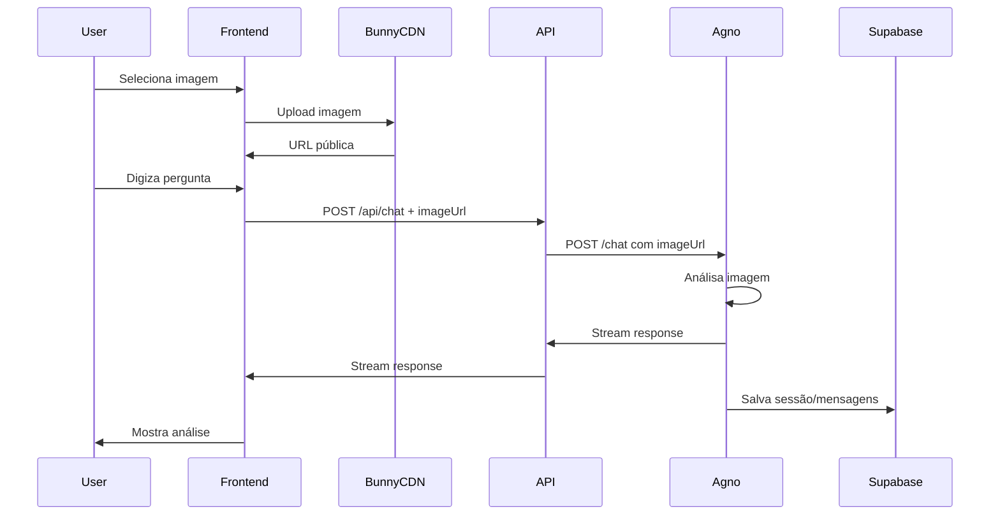

# Guia de Integração: Chat com Upload de Imagens e Sessões

Este guia explica como usar e integrar as funcionalidades de chat com upload de imagens e gerenciamento de sessões do Odonto GPT.

## 📋 Índice

- [Visão Geral](#visão-geral)
- [Configuração Inicial](#configuração-inicial)
- [Upload de Imagens](#upload-de-imagens)
- [Gerenciamento de Sessões](#gerenciamento-de-sessões)
- [Fluxo Completo](#fluxo-completo)
- [Exemplos de Código](#exemplos-de-código)
- [Solução de Problemas](#solução-de-problemas)

## Visão Geral

O sistema agora suporta:

1. **Upload de imagens dentais** para análise via AI
2. **Sessões persistentes** que salvam o histórico de conversas
3. **Cache local** para performance otimizada
4. **Histórico de conversas** para consulta posterior

### Componentes Principais

```
components/chat/
├── chat-interface.tsx       # Interface principal com suporte a imagens
└── image-upload.tsx         # Componente de upload drag-and-drop

lib/
├── bunny/
│   └── upload.ts            # Utilitários para upload Bunny CDN
└── ai/
    ├── agno-service.ts      # Cliente do Agno Python service
    └── session-cache.ts     # Cache local de sessões

app/api/
├── chat/route.ts            # API de chat com suporte a imagens
└── sessions/
    ├── route.ts             # API de sessões (list, create)
    └── [id]/route.ts        # API de sessão individual (get, update, delete)
```

## Configuração Inicial

### 1. Variáveis de Ambiente

Adicione ao seu arquivo `.env.local`:

```env
# Bunny CDN (para upload de imagens)
BUNNY_STORAGE_ZONE=seu-storage-zone
BUNNY_STORAGE_API_KEY=sua-api-key
BUNNY_CDN_BASE_URL=https://seu-pull-zone.b-cdn.net

# Agno Service (Python)
AGNO_SERVICE_URL=http://localhost:8000/api/v1
```

### 2. Aplicar Migration

Execute a migration para criar as tabelas de sessões:

```bash
npm run db:push
```

Isso criará:
- `agent_sessions` - Tabela de metadados de sessões
- `agent_messages` - Tabela de mensagens dentro de sessões

### 3. Iniciar Agno Service

```bash
cd odonto-gpt-agno-service
npm run agno:dev
```

O serviço estará disponível em `http://localhost:8000`

## Upload de Imagens

### Como Funciona

1. Usuário arrasta ou seleciona imagens
2. Upload é feito para Bunny CDN
3. URL pública é retornada
4. URL é enviada junto com a mensagem ao Agno service
5. AI analisa a imagem e responde

### Componente de Upload

```tsx
import { ImageUpload, type UploadedImage } from "@/components/chat/image-upload"

function ChatComponent() {
  const [images, setImages] = useState<UploadedImage[]>([])

  return (
    <ImageUpload
      images={images}
      onImagesChange={setImages}
      maxFiles={3}
      userId={user.id}
      disabled={isLoading}
    />
  )
}
```

### Validações

- **Formatos aceitos**: JPEG, PNG, GIF, WebP
- **Tamanho máximo**: 10MB por imagem
- **Quantidade máxima**: 3 imagens (configurável via `maxFiles`)

### Upload Manual

```typescript
import { uploadChatImage } from "@/lib/bunny/upload"

const result = await uploadChatImage(file, userId)

if (result.success) {
  console.log("URL pública:", result.url)
  console.log("Caminho:", result.path)
} else {
  console.error("Erro:", result.error)
}
```

## Gerenciamento de Sessões

### O que são Sessões?

Sessões representam uma conversa completa entre o usuário e a AI. Cada sessão contém:
- **ID único** (UUID)
- **Tipo de agente** (qa, image-analysis, orchestrated)
- **Status** (active, completed, error)
- **Metadados** adicionais
- **Mensagens** da conversa

### API de Sessões

#### Listar Sessões

```typescript
const response = await fetch("/api/sessions?limit=20&offset=0")
const { sessions } = await response.json()
```

#### Criar Nova Sessão

```typescript
const response = await fetch("/api/sessions", {
  method: "POST",
  headers: { "Content-Type": "application/json" },
  body: JSON.stringify({
    agentType: "qa",
    metadata: { source: "dashboard" }
  })
})
const { session } = await response.json()
```

#### Obter Sessão Específica

```typescript
const response = await fetch(`/api/sessions/${sessionId}`)
const { session } = await response.json()
console.log(session.messages) // Todas as mensagens
```

#### Deletar Sessão

```typescript
const response = await fetch(`/api/sessions/${sessionId}`, {
  method: "DELETE"
})
```

### Cache Local

Para melhorar performance, implementamos cache local:

```typescript
import {
  fetchSessions,
  getCachedSessions,
  updateCachedSession,
  deleteSession
} from "@/lib/ai/session-cache"

// Buscar com cache
const { sessions, fromCache } = await fetchSessions({
  limit: 20,
  forceRefresh: false
})

// Obter do cache (síncrono)
const cached = getCachedSessions()

// Deletar (atualiza cache automaticamente)
await deleteSession(sessionId)
```

**Configurações do Cache:**
- **Duração**: 5 minutos
- **Limite**: 50 sessões mais recentes
- **Storage**: localStorage

## Fluxo Completo

### Chat com Imagem



### Página de Histórico

Acessível em `/dashboard/chat/history`:

1. **Listagem** de todas as sessões
2. **Preview** do tipo e quantidade de mensagens
3. **Ações**: Ver detalhes, Excluir
4. **Cache** para carregamento rápido

## Exemplos de Código

### Integração Completa

```tsx
"use client"

import { useState } from "react"
import { useChat } from "@ai-sdk/react"
import { ImageUpload, type UploadedImage } from "@/components/chat/image-upload"
import { ChatInterface } from "@/components/chat/chat-interface"

export default function ChatPage() {
  const [uploadedImages, setUploadedImages] = useState<UploadedImage[]>([])

  return (
    <div>
      <ChatInterface
        plan="free"
        userId={user.id}
      />
    </div>
  )
}
```

### Listar Histórico com Filtro

```tsx
"use client"

import { useEffect, useState } from "react"
import { fetchSessions, type AgentSession } from "@/lib/ai/session-cache"

export function SessionList({ agentType }: { agentType?: string }) {
  const [sessions, setSessions] = useState<AgentSession[]>([])

  useEffect(() => {
    async function load() {
      const { sessions } = await fetchSessions({
        agentType,
        limit: 20
      })
      setSessions(sessions)
    }
    load()
  }, [agentType])

  return (
    <div>
      {sessions.map(session => (
        <div key={session.id}>
          {session.agentType} - {session.messageCount} mensagens
        </div>
      ))}
    </div>
  )
}
```

### Upload com Progresso

```tsx
import { uploadChatImage, fileToBase64 } from "@/lib/bunny/upload"

async function handleUpload(files: File[]) {
  const uploads = files.map(async (file) => {
    // Mostrar preview imediato
    const preview = await fileToBase64(file)

    // Fazer upload
    const result = await uploadChatImage(file, userId)

    return { ...result, preview }
  })

  const results = await Promise.all(uploads)
  const successful = results.filter(r => r.success)

  console.log(`${successful.length}/${files.length} imagens enviadas`)
}
```

## Solução de Problemas

### Upload Falha

**Problema**: Erro ao fazer upload de imagem

**Soluções**:
1. Verifique variáveis de ambiente Bunny CDN
2. Confirme que o storage zone existe
3. Verifique o tamanho do arquivo (máx 10MB)
4. Teste com `npm run test:bunny`

### Sessões Não São Salvas

**Problema**: Sessões não aparecem no histórico

**Soluções**:
1. Confirme que a migration foi aplicada: `npm run db:status`
2. Verifique se o Agno service está rodando
3. Confirme que `SUPABASE_DB_URL` está configurado no Agno service
4. Verifique as policies RLS nas tabelas `agent_sessions` e `agent_messages`

### Análise de Imagem Não Funciona

**Problema**: AI não analisa a imagem

**Soluções**:
1. Confirme que `imageUrl` está sendo enviado no body da requisição
2. Verifique se o Image Agent está configurado no Agno service
3. Teste o endpoint `/api/v1/image/analyze` diretamente
4. Verifique se a URL da imagem é pública (acessível sem auth)

### Cache Desatualizado

**Problema**: Histórico mostra dados antigos

**Solução**: Force refresh do cache

```typescript
const { sessions } = await fetchSessions({
  forceRefresh: true  // Ignora cache e busca da API
})
```

Ou limpe o cache completamente:

```typescript
import { clearCachedSessions } from "@/lib/ai/session-cache"
clearCachedSessions()
```

### Erro CORS com Agno Service

**Problema**: Requisições ao Agno service falham

**Solução**: Configure CORS no `odonto-gpt-agno-service/app/main.py`

```python
from fastapi.middleware.cors import CORSMiddleware

app.add_middleware(
    CORSMiddleware,
    allow_origins=["http://localhost:3000"],  // Adicione seu frontend
    allow_credentials=True,
    allow_methods=["*"],
    allow_headers=["*"],
)
```

## Recursos Adicionais

- [CLAUDE.md](../CLAUDE.md) - Documentação geral do projeto
- [odonto-gpt-agno-service/README.md](../odonto-gpt-agno-service/README.md) - Documentação do Agno service
- [docs/bunny-cdn-setup.md](./bunny-cdn-setup.md) - Configuração Bunny CDN

## Suporte

Para problemas ou dúvidas:
1. Verifique os logs do console do navegador
2. Verifique os logs do Agno service (terminal)
3. Consulte a aba Network do DevTools
4. Confirme as variáveis de ambiente com `npm run validate:env`
